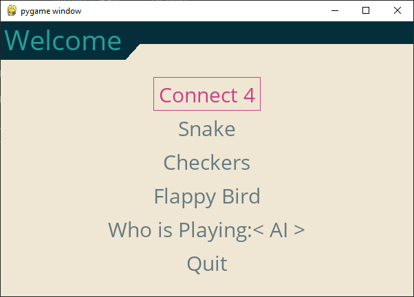
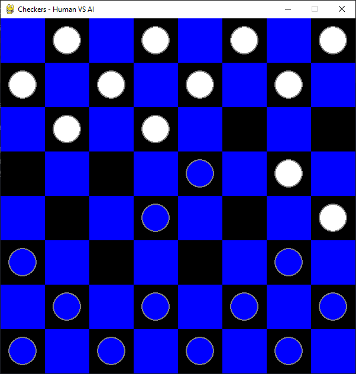
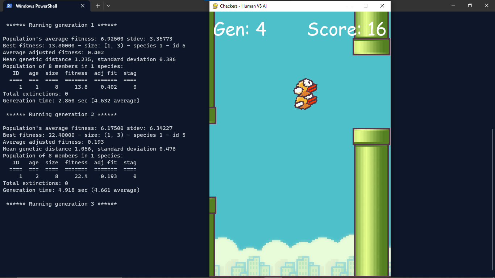
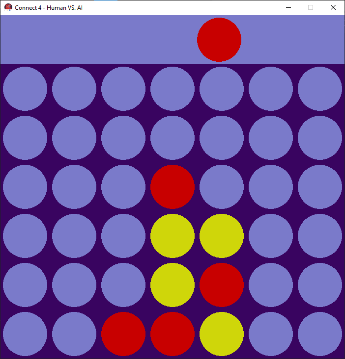

# AI in Interactive Games - Checkers, Flappy Bird, Connect Four

## Steps to run program locally
- Install the required packages:
    ```bash
    $ pip install -r requirements.txt
	```

- Run the program
	```bash
	$ python interface.py
	```

#

## Screenshots

### Main Menu


### Checkers


### Flappy Bird


### Connect-Four


#

## Methodology

### For Checkers and Connect-Four :-
#### We have used minimax algorithm, which is used in decision-making and game theory. It provides an optimal move for the player assuming that opponent is also playing optimally. It uses recursion to search through the game-tree.

### For Flappy Bird :-
We have deployed NeuroEvolution of Augmenting Topologies (NEAT), which is a genetic algorithm for the generation of evolving artificial neural networks.